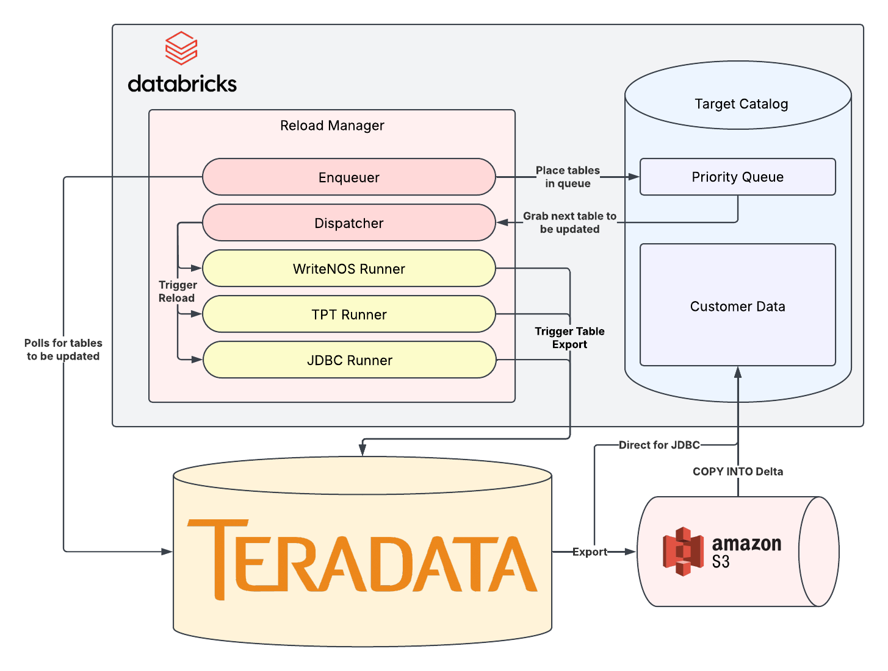

# 🔄 Reload Manager
Queue-based framework to support table loads from source systems into Databricks

Source systems currently supported:
 - Teradata
   - `WriteNOS` on AWS S3 (please contribute other clouds!)
   - `JDBC`

## What does `reloadmanager` do?

This tool is designed to be an extensible metadata-driven frameowrk for managing one-off, batch, or continuous loads from a source system (currently only Teradata) into Databricks.

It was built for data engineers who need to:
 - snapshot or CDC tables out of Teradata (via WriteNOS)
 - land data as Delta tables
 - not worry about threads and execution, just implementing the buisiness logic 
 - throttle concurrency, respect table priority, and never babysit bash again 🚀


## ✨ Features

### 🥇 Priority Queue 
A Delta-based queue which supports staleness tracking and priority assignment.

### 🧵Threaded Dispatcher 
Spin up `n` worker threads that call load runners in parallel while respecting cluster concurrency

### 🧱Pluggable Runners 
Drop‑in classes (e.g. WriteNOSRunner) so you can support Snowflake export tomorrow without touching the queue engine

### 🔐 Databricks Bundle‑aware 
Ships a sample databricks.yaml; just plug in your workspace IDs and you’re live

### 📜 Typed Config Builders 
No more yaml‐string concatenation hell; build config objects in Python and dataclasses.asdict() them


## Getting Started

### Pre-requisites
- have a Databricks workspace
- have permission to create a secret scope
- identify a cluster to use
- install and configure [Databricks CLI](https://docs.databricks.com/aws/en/dev-tools/cli/install)

### Configure

1. Update `databricks.yaml` with your workspace and cluster ID
2. Add the following environemnt variable to your compute `DBX_SECRET_SCOPE=reloadmanager`
3. Populate the Teradata secrets (used in `reloadmanager.clients.teradata_client.TeradataClient`):
   1. `TD_HOST`: the hostname, e.g. `server.company.com`
   2. `TD_USER`: teradata user to authenticate against
   3. `TD_PASS`: teradata password
4. Create an authorization object between Teradata and S3. Name it `TD_USER`. It will used in WriteNOS like:
```sql
SELECT *
FROM WRITE_NOS (
ON  (SELECT ... FROM ..)
USING
AUTHORIZATION(<TD_USER>.authAccess)
LOCATION('<storage_location>')
```

### Customize
The `Enqueuer` workflow is intended to be project-specific while the `Dispatcher` and `*_runner` jobs are intended to
be resuable. Roll your own enqueuer workflow using your own batch or event-driven sources!

### Deploy
```
cd your/cloned/repo
databricks bundle deploy -p [profile]
```

## Technical Details


### Workflows
- `Enqueuer`: puts tables into the queue to be reloaded. All project-specific logic should reside here only
- `Dispatcher`: you specify the number of threads and import types, this dispatches loads for you and updates the queue 
history table for tracking
- `WriteNOS_Runner`: workflow that takes a table and reloads it using WriteNOS. Called by the `Dispatcher` or manually.
- `JDBC_Runner`: workflow that takes a table and reloads it using JDBC. Called by the `Dispatcher` or manually.
- `TPT_Runner`: workflow that takes a table and reloads it using TPT. *Not yet implemented.*

### `PriorityQueue`
The `PriorityQueue` comprises two Delta tables:
- `queue`: the current queue
- `queue_history`: a record of all the tables that have been loaded

And the class `reloadmanager.priority_queue.PriorityQueue` which will help interact with these.

## Contribute
We'd love to see your additions. Feel free to contribute back. Contact Dan Z for help with your first PR. 

